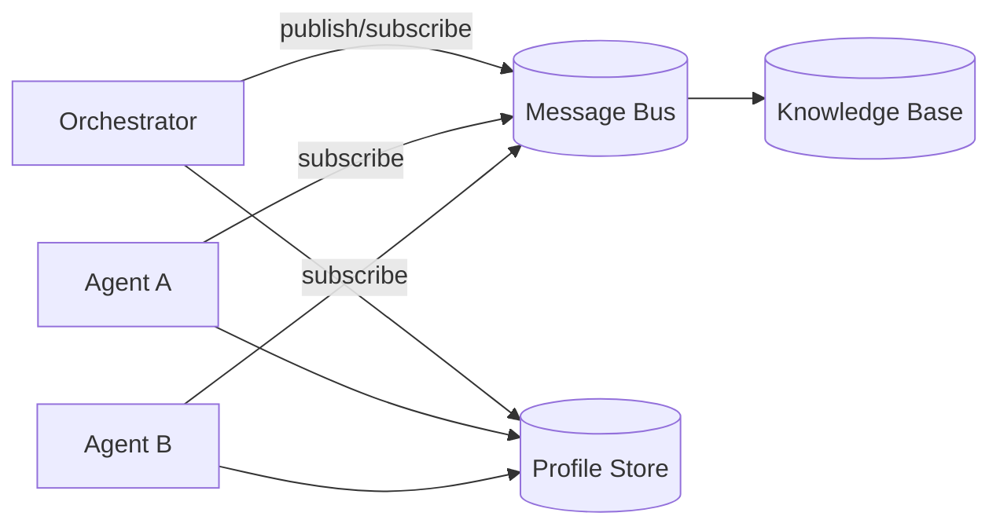
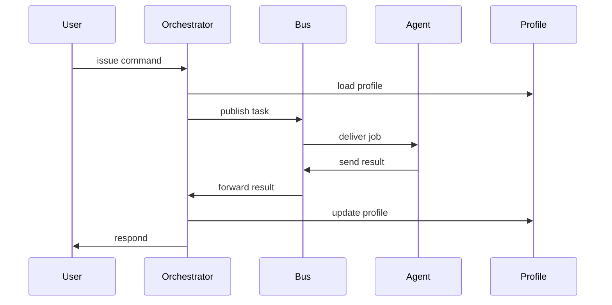

# Architecture

The 3Agenteers CLI is composed of modular subsystems bound by a simple message bus. The design follows H-Net principles of dynamic chunking and hierarchical processing to keep agents responsive and scalable.

## Core Subsystems

### Orchestrator
- Acts as the control plane and admin TUI.
- Dispatches tasks, aggregates results, and updates the knowledge base.

### Agents
- Specialized workers that subscribe to topics on the bus.
- Each agent manages its own short-term memory while H-Net chunking promotes long-horizon context.

### Message Bus
- Lightweight publish/subscribe server for decoupled communication.
- Enforces bearer-token authentication and logs unauthorized access.

### Profile Service
- Persists agent credentials and role-based policies.
- Provides profile lookup and updates during task execution.

## Setup Diagram

## Task Sequence

## Extensibility
- New agents register on the bus and integrate with the profile store.
- Additional transports or storage layers can replace defaults as long as interfaces remain stable.
